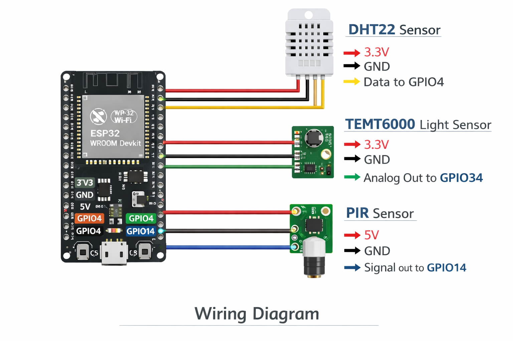

# Smart Wall Art - Interactive Art That Changes Based on Environmental Input

The **_Smart Wall Art_** project seeks to merge art and technology
to create dynamic, interactive experiences that adapt to the user’s environment.
This project is motivated by the desire to make art more engaging, interactive,
and emotionally resonant, enabling it to actively respond to the daily rhythms
of life. 
It also emphasizes creativity, exploring how IoT technology can enhance our emotional connection with visual experiences.

## Sensing Node PIN configuration

  

## Dashboard

Link to the dashboard: [Grafana](https://simonereale.grafana.net/goto/df73pdvapm134a?orgId=1)
